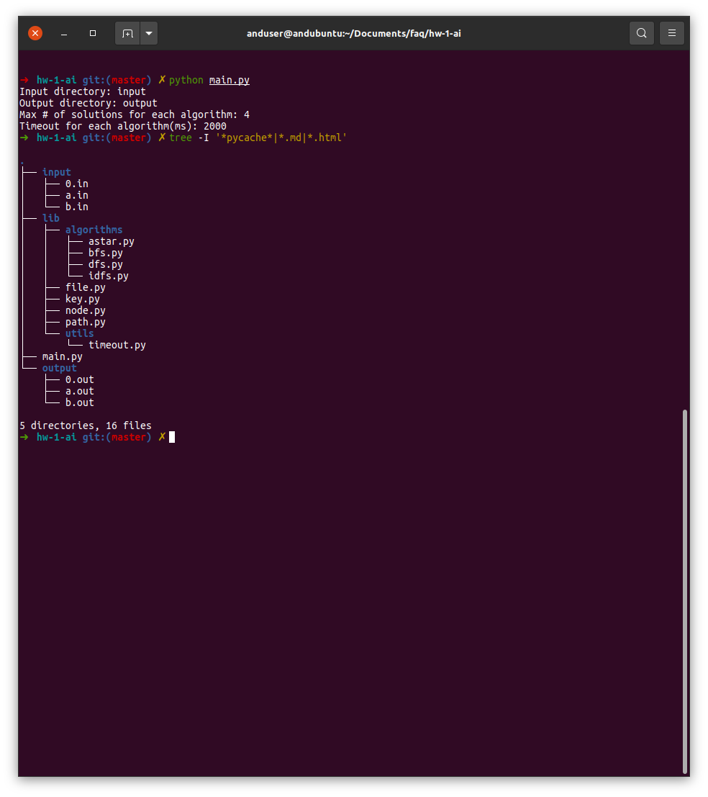

# Problema unui lacat

- [Problema unui lacat](#problema-unui-lacat)
  - [Apelarea programului](#apelarea-programului)
  - [Euristici](#euristici)
    - [Prima euristica admisibila](#prima-euristica-admisibila)
    - [A doua euristica admisibila](#a-doua-euristica-admisibila)
    - [Euristica neadmisibila](#euristica-neadmisibila)
  - [Performantele algoritmilor](#performantele-algoritmilor)
    - [BFS](#bfs)
    - [DFS](#dfs)
    - [DFI](#dfi)
    - [A*](#a)
  - [Link-uri utile](#link-uri-utile)

## Apelarea programului

Apelarea programului se realizeaza prin invocarea comenzii `python main.py` din CLI:

<div style="text-align: center;">
  
</div>

---

## Euristici

### Prima euristica admisibila

```python
def v1_heuristic(node: Node, _):
  return reduce(lambda sum, keyhole_state: sum + keyhole_state, node.state)
```

Din moment ce lacatul se considera deblocat complet atunci cand toate incuietorile sale sunt descuiate(i.e. toate au valoarea `0`), o prima varianta de euristica este aceea de a calcula, pentru o stare a lacatului, suma valorilor incuietorilor.

### A doua euristica admisibila

```python
def v2_heuristic(node: Node, unfair_key: Tuple[int, int]):
  (guilty_idx, _) = unfair_key

  res = 0
  for i in range(0, len(node.state)):
    keyhole_state = node.state[i]

    if i == guilty_idx:
      res += 2 * keyhole_state
    else:
      res += keyhole_state

  return res
```

Asemanator cu modul in care functioneaza euristica din sectiunea anterioara, aceasta euristica determina suma valorilor incuietorilor pentru o stare a lacatului, dar ia in considerare si **incuietoarea cu truc**.

Spre exemplu, daca incuietoarea cu truc are valoarea `3`, atunci, pentru ca lacatul sa ajunga deblocat, trebuie ca aceasta incuietoare sa ajunga si ea, precum celelalte incuietori, la valoarea `0`. Insa, fiindca aceasta este cu truc, pentru fiecare descuiere a acesteia, se va incuia inca o data incuietoare *afectata* de acest truc. Asadar, incuietoarea *afectata* va trebui sa fie descuiata de inca `3` ori(valoarea incuietorii cu truc), pe langa numarul deja existent.  
Din acest motiv, se va adauga `res += 2 * keyhole_state`, `keyhole_state` reprezentand valoarea incuietorii cu truc.

### Euristica neadmisibila

```python
def non_admissible_heuristic(node: Node, _):
  return reduce(lambda nr_locked, keyhole_state: nr_locked + (1 if keyhole_state > 0 else 0), node.state, 0)
```

Euristica de mai sus determina cate incuietori nu sunt inca descuiate. Cu alte cuvinte, returneaza numarul incuietorilor a caror valoare este diferita de `0`.

Demonstratia ca aceasta euristica nu este una admisibila se poate face printr-un exemplu.

Dat fiind acest fisier de input:

```
2
0->5
dgiddig
ddgigig
ggddggd
iigiddd
ddiiggg
iiddgii
igiddid
ggdggdd
```

Ruland programul, se obtine urmatorul fisier de output:

```
A* - v2 heuristic - unfair key = (0, 5)
Index: 1
Length: 7
Cost: 12
Found at: 0.0045818949984095525
Max nr. of nodes in memory: 105
Total nr. of computed successors: 256
The path: 
	1111111
	ggddggd
	1100110
	ggdggdd
	1100100
	ddiiggg
	0011110
	dgiddig
	0020020
	ggdggdd
	0010010
	ggdggdd
	0000000


==================================================

A* - non-admissible heuristic - unfair key = (0, 5)
Index: 1
Length: 9
Cost: 14
Found at: 1.6594917500005977
Max nr. of nodes in memory: 3347
Total nr. of computed successors: 16824
The path: 
	1111111
	ggddggd
	1100110
	ggdggdd
	1100100
	ddiiggg
	0011110
	ddiiggg
	0022110
	dgiddig
	0031020
	ggdggdd
	0021010
	ggddggd
	0010010
	ggdggdd
	0000000
```

*Parti din fisier au fost omise pentru a pastra esenta.*

Asa cum se poate observa, folosirea euristicii neadmisibile duce la un cost minim mai mare decat minimul adevarat. Nu numai atat, dar sunt folosite si mai multe resurse - numarul total de succesori generati si numarul maxim de noduri aflate, la un moment dat, in memorie.

---

## Performantele algoritmilor

Pentru aceasta problema, din moment ce se mentioneaza in enunt starea de la care trebuie sa plece lacatul, starea initiala nu poate fi alta decat cea in care toate incuietorile au valoarea `1`. Prin urmare, nu s-a putut crea un fisier care da o stare initiala care sa fie, totodata, si finala.

Pentru tabelele ce urmeaza fi afisate, vom considera doua fisiere de intrare: `a.in`(pentru care toti algoritmii implementati reusesc sa gaseasca drumuri in *timeout*-ul dat) si `b.in`(care ilustreaza euristica neadmisibila).

Continutul fisierului `a.in` este:

```
2
0->3
iigid
dddgg
iiddg
igidd
ddddg
```

Continutul fisierului `b.in` este:

```
2
0->5
dgiddig
ddgigig
ggddggd
iigiddd
ddiiggg
iiddgii
igiddid
ggdggdd
```

Exista, de asemenea, si fisierul `0.in`, pentru care toti algoritmii depasesc timeout-ul specificat:

```
2
0->5
gidddig
dggiigg
idgdddg
diiggid
didgidd
dddidgi
iigdigd
ddidgdd
```

*De mentionat: pentru output-ul fisierelor de mai jos s-au folosit urmatoarele optiuni de configurare: timeout de `2` secunde si `NRSOL` egal cu `4`*.

### BFS

<table>
  <thead>
    <tr>
      <th>Fisier</th>
      <th>Lungime drum</th>
      <th>Cost drum</th>
      <th>Nr. maxim de noduri in memorie</th>
      <th>Nr. total de succesori generati</th>
    </tr>
  </thead>

  <tbody>
    <tr>
      <td>a.in</td>
      <td>4</td>
      <td>7</td>
      <td>501</td>
      <td>630</td>
    </tr>
    <tr>
      <td>a.in</td>
      <td>4</td>
      <td>7</td>
      <td>576</td>
      <td>725</td>
    </tr>
    <tr>
      <td>a.in</td>
      <td>5</td>
      <td>8</td>
      <td>1336</td>
      <td>1705</td>
    </tr>
    <tr>
      <td>a.in</td>
      <td>5</td>
      <td>8</td>
      <td>1406</td>
      <td>1795</td>
    </tr>
    <tr>
      <td>b.in</td>
      <td colspan="4" style="text-align: center;">Timeout exceeded.</td>
    </tr>
  </tbody>
</table>

### DFS

<table>
  <thead>
    <tr>
      <th>Fisier</th>
      <th>Lungime drum</th>
      <th>Cost drum</th>
      <th>Nr. maxim de noduri in memorie</th>
      <th>Nr. total de succesori generati</th>
    </tr>
  </thead>

  <tbody>
    <tr>
      <td>a.in</td>
      <td>4</td>
      <td>7</td>
      <td>25</td>
      <td>36840</td>
    </tr>
    <tr>
      <td>a.in</td>
      <td>5</td>
      <td>8</td>
      <td>25</td>
      <td>64010</td>
    </tr>
    <tr>
      <td>a.in</td>
      <td>6</td>
      <td>10</td>
      <td>25</td>
      <td>64015</td>
    </tr>
    <tr>
      <td>a.in</td>
      <td>7</td>
      <td>11</td>
      <td>25</td>
      <td>64875</td>
    </tr>
    <tr>
      <td>b.in</td>
      <td colspan="4" style="text-align: center;">Timeout exceeded.</td>
    </tr>
  </tbody>
</table>

### DFI

*De mentionat: acest algoritm a fost rulat cu adancimea maxima de `5`*.

<table>
  <thead>
    <tr>
      <th>Fisier</th>
      <th>Lungime drum</th>
      <th>Cost drum</th>
      <th>Nr. maxim de noduri in memorie</th>
      <th>Nr. total de succesori generati</th>
    </tr>
  </thead>

  <tbody>
    <tr>
      <td>a.in</td>
      <td>4</td>
      <td>7</td>
      <td>13</td>
      <td>20</td>
    </tr>
    <tr>
      <td>a.in</td>
      <td>4</td>
      <td>7</td>
      <td>13</td>
      <td>45</td>
    </tr>
    <tr>
      <td>a.in</td>
      <td>4</td>
      <td>7</td>
      <td>16</td>
      <td>40</td>
    </tr>
    <tr>
      <td>a.in</td>
      <td>5</td>
      <td>8</td>
      <td>16</td>
      <td>55</td>
    </tr>
    <tr>
      <td>b.in</td>
      <td colspan="4" style="text-align: center;">Timeout exceeded.</td>
    </tr>
  </tbody>
</table>

### A*

<table>
  <thead>
    <tr>
      <th>Fisier</th>
      <th>Lungime drum</th>
      <th>Cost drum</th>
      <th>Nr. maxim de noduri in memorie</th>
      <th>Nr. total de succesori generati</th>
      <th>Euristica folosita</th>
    </tr>
  </thead>

  <tbody>
    <tr>
      <td>a.in</td>
      <td>4</td>
      <td>7</td>
      <td>14</td>
      <td>25</td>
      <td><a href="#prima-euristica-admisibila">V1</a></td>
    </tr>
    <tr>
      <td>a.in</td>
      <td>4</td>
      <td>7</td>
      <td>14</td>
      <td>25</td>
      <td><a href="#a-doua-euristica-admisibila">V2</a></td>
    </tr>
    <tr>
      <td>a.in</td>
      <td>4</td>
      <td>7</td>
      <td>50</td>
      <td>130</td>
      <td><a href="#euristica-neadmisibila">Neadmisibila</a></td>
    </tr>
    <tr>
      <td>b.in</td>
      <td>7</td>
      <td>12</td>
      <td>149</td>
      <td>384</td>
      <td><a href="#prima-euristica-admisibila">V1</a></td>
    </tr>
    <tr>
      <td>b.in</td>
      <td>7</td>
      <td>12</td>
      <td>105</td>
      <td>256</td>
      <td><a href="#a-doua-euristica-admisibila">V2</a></td>
    </tr>
    <tr>
      <td>b.in</td>
      <td>9</td>
      <td>14</td>
      <td>3347</td>
      <td>16824</td>
      <td><a href="#euristica-neadmisibila">Neadmisibila</a></td>
    </tr>
  </tbody>
</table>

---

## Link-uri utile

* https://stackoverflow.com/questions/308999/what-does-functools-wraps-do
* https://stackoverflow.com/a/2282656/9632621